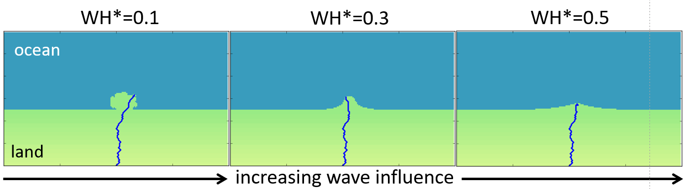

The River Avulsion and Floodplain Evolution Model (RAFEM) is a morphodynamic
model designed to be coupled with the Coastline Evolution Model (CEM).

Getting Started
---------------

.. toctree::
   :maxdepth: 3

   readme

..   usage
..   installation

API Reference
-------------

If you are looking for information on a specific function, class, or
method, this part of the documentation is for you.

.. toctree::
   :maxdepth: 2

   api/index

Miscellaneous Pages
-------------------

.. toctree::
   :maxdepth: 2

   contributing
   authors
   license

Indices and tables
==================
* :ref:`genindex`
* :ref:`modindex`
* :ref:`search`
